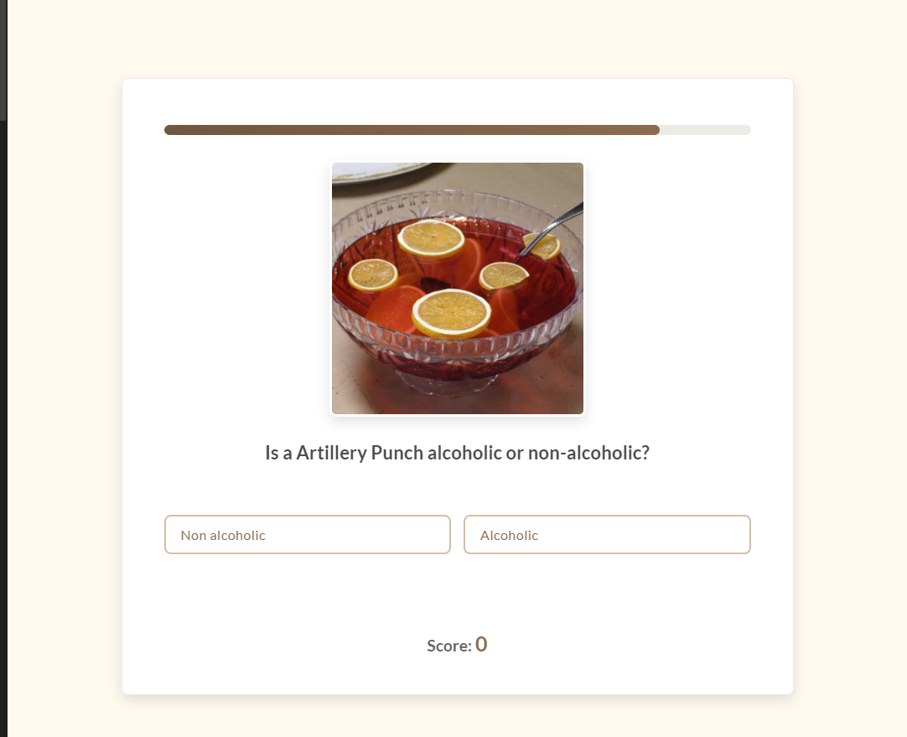

# 🍸 Quiz On The Rocks!🍹
[](https://github.com/Moringa-SDF-PT10/ike-mwithiga-cocktail-quiz)
[](https://www.thecocktaildb.com/)

> *An interactive, single-player **Single Page Application (SPA)** testing cocktail knowledge with dynamically fetched questions from a public API, multiple categories, timed responses, and engaging visuals.*

---
## 📝 Project Overview

This project is a web-based quiz game designed as a **Single Page Application (SPA)** to challenge and entertain users with trivia about cocktails. It integrates fundamental front-end development skills, utilizing **HTML, CSS, and Vanilla JavaScript** to create an interactive user experience. The application communicates with the public **TheCocktailDB API** as its dynamic data source, ensuring a varied question set across multiple sessions.

The SPA guides the user through an animated start sequence, allows category selection, presents timed questions with immediate feedback, tracks the score, and provides a review of incorrect answers upon completion, culminating in a confetti celebration for high scores.

---
## 🔗 Dependencies

This project relies on:

1.  **[TheCocktailDB API](https://www.thecocktaildb.com/)**(Core) Provides all cocktail data via `Workspace`.
2.  **[Font Awesome](https://fontawesome.com/):** (Visual) For icons (categories, loading fallback). Integrated via CDN.
3.  **[Google Fonts](https://fonts.google.com/):** (Visual) For 'Playfair Display' & 'Lato' typography. Integrated via `<link>`.
4.  **[Canvas Confetti](https://github.com/catdad/canvas-confetti):** (Visual) For high-score celebration. Integrated via CDN.
5.    **GitHub Pages** (Deployment)
---


## 🧰 Tech Stack (Skills & Concepts Demonstrated)

This SPA integrates and showcases proficiency in the following areas:

 **HTML**
* Semantic Element Usage (`h1`-`h3`, `ul`, `li`, `button`, etc.)
* Image Handling (`img` tag, dynamic `src`, `alt`)

 **CSS**
* Layout Techniques (Flexbox, CSS Grid)
* Keyframe Animations (`@keyframes` for fade, slide, shake, shrink)
* CSS Transitions (for hover effects, opacity)
* Advanced Selectors (Attribute, Pseudo-classes like `:hover`, `:disabled`)
* Styling UI States (e.g., `.correct`, `.incorrect`, `.hidden`, `.timer-hidden`)

 **Vanilla JavaScript**
* Asynchronous JavaScript (`async`/`await`, Promises)
* API Communication (`Workspace` API)
* DOM Manipulation (Selecting elements, Creating elements, Modifying content/styles/classes)
* Event Handling (`addEventListener`, Event Delegation)
* Functions (Arrow functions `=>`, Helper functions)
* Arrays & Objects (Literals, Destructuring, Methods: `map`, `filter`, `some`, `forEach`, spread `...`)
* Conditional Logic (`if/else`, ternaries where applicable)
* External Library Integration (Canvas Confetti)
---

## 📸 Preview

*Initial screen inviting the user to start the quiz.*


Gameplay showing a question, image (if applicable), options, and

---

## ✨ Features

-   👤 **Single Player Challenge** – Test your own cocktail expertise against the clock.
-   🥃 **Quiz Categories** – Choose from diverse topics:
    -   Ingredients (What's *not* in this drink?)
    -   Glassware (What glass is it served in?)
    -   Image Recognition (Guess the cocktail by its picture!)
    -   Alcoholic / Non-Alcoholic classification.
-   📊 **Dynamic Questions** – Fetches fresh data from TheCocktailDB API for each quiz session.
-   ⏳ **Visual Timer Bar** – A smoothly shrinking bar shows the 15 seconds available per question.
-   ✅ **Instant Feedback** – Know immediately if your answer was correct or incorrect.
-   🎉 **High Score Celebration** – Get a satisfying confetti burst for achieving a high score (4 or 5 out of 5)
-   📈 **Score Tracking & Review** – See your final score and review any questions you missed with the correct answers provided.
-   📱 **Responsive Design** – Playable on desktop, tablet, or mobile.
---

## 🚀 Getting Started & How to Play

**Prerequisites:**

* **Git:** You need Git installed to clone the repository. You can download it from [git-scm.com](https://git-scm.com/).
* **Web Browser:** Any modern web browser (like Chrome, Firefox, Edge, Safari) is required to view the application.
* **Code Editor (Optional):** An editor like [VS Code](https://code.visualstudio.com/) is helpful for viewing or modifying the code.
* **Node.js & npm (Optional):** Needed only if you want to use the `live-server` package method described below. Download from [nodejs.org](https://nodejs.org/).

**Steps:**

**1. Clone the Repository:**
   * Open your terminal or command prompt.
   * Navigate to the directory where you want to store the project (e.g., your Desktop or a dedicated 'projects' folder) using the `cd` (change directory) command.
     ```bash
     # Example: Navigate to your Desktop (command might vary slightly by OS)
     cd ~/Desktop
     ```
   * Clone the repository using the following command. 
     ```bash
     git clone git@github.com:Moringa-SDF-PT10/ike-mwithiga-cocktail-quiz.git
     ```
   * This command will download the project files into a new folder named `ike-mwithiga-cocktail-quiz` within your current directory.

**2. Navigate into the Project Directory:**
   * Once cloning is complete, move into the newly created project folder:
     ```bash
     cd ike-mwithiga-cocktail-quiz
     ```

**3. Add Assets (Optional, for Loading Animation):**
   * If you want the custom cocktail shaker loading animation:
     * Create a folder named `assets` inside the `ike-mwithiga-cocktail-quiz` directory (if it doesn't already exist).
     * Find or create an animated GIF of a cocktail shaker and save it as `shaker-animation.gif` inside the `assets` folder.
   * *If you skip this step, the application will use a fallback Font Awesome icon animation.*

**4. Run the Application:**
   **Method A: Open `index.html` Directly (Simple)**
   * Navigate to the project folder (`ike-mwithiga-cocktail-quiz`) in your computer's file explorer.
   * Double-click the `index.html` file.
   * It should open in your default web browser.

   **Method B: Use a Local Web Server (Recommended)**
  * **Option B.1: Using VS Code & Live Server Extension:**
     * Open the project folder (`ike-mwithiga-cocktail-quiz`) in Visual Studio Code.
     * Make sure you have the "Live Server" extension installed.
     * Right-click on the `index.html` file in the VS Code Explorer panel.
     * Select "Open with Live Server".
     * Your browser should automatically open, displaying the quiz, usually at an address like `http://127.0.0.1:5500/index.html`.

**5. Play!**
   * Once the application is open in your browser (using either Method A or B), follow the "How to Play" instructions below.


---
## 🧠 How to Play

1. **Landing Page**  
   - Click "Let's Go!"...
2. **Category Selection**  
   - Choose quiz type: image, ingredients, glassware, or alcoholic content  
3. **5 Rounds**  
   - Answer questions before the timer bar runs out...Receive immediate feedback...
4. **Score Display**  
   - View final score and review incorrect answers...
5. **Winning Moment**  
   - Confetti animation
   - Click "Play Again?" to restart...Ulae

---

## ❗ Known Limitations
- Some cocktails returned from the API may lack complete data (e.g., missing ingredients or images)  
- The API sometimes repeats cocktails due to limited filtering options  

---

## 🙌 Acknowledgements

- 🍹 Data from **[TheCocktailDB](https://www.thecocktaildb.com/)**
- <i class="fa-solid fa-icons"></i> Icons by **[Font Awesome](https://fontawesome.com/)**
- ✨ Fonts from **[Google Fonts](https://fonts.google.com/)**
- 🎉 Confetti animation by **[Canvas Confetti](https://www.kirilv.com/canvas-confetti/)**
- 💻 Hosted on **[GitHub Pages](https://pages.github.com/)**

---

## 📄 License

Distributed under the MIT License. See `LICENSE` file for more information (if included).

MIT © [Your Name](https://github.com/yourusername)

> *"Why limit happy to an hour?"*